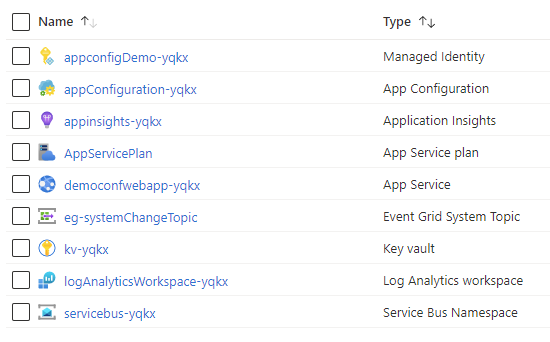
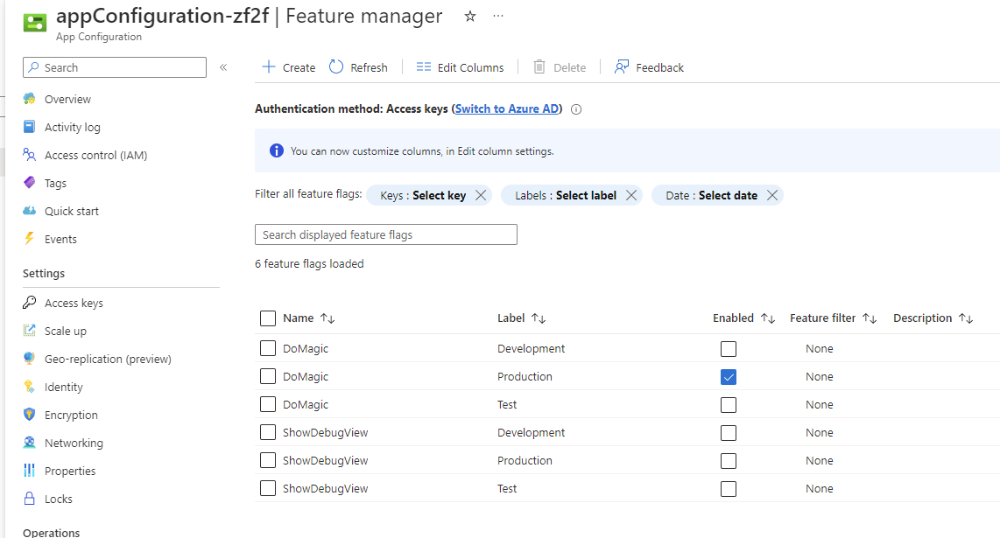
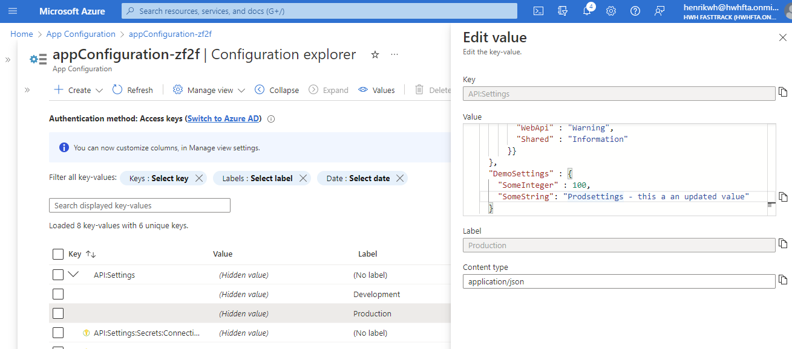
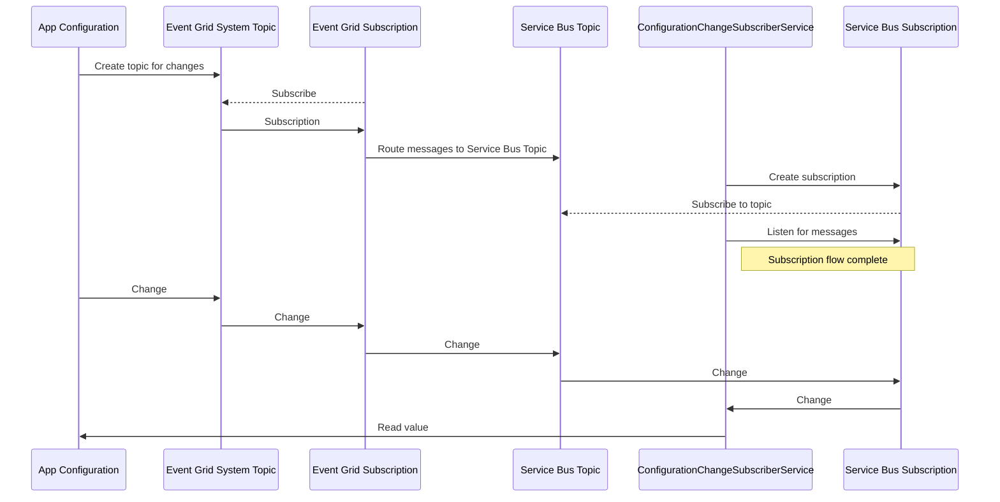
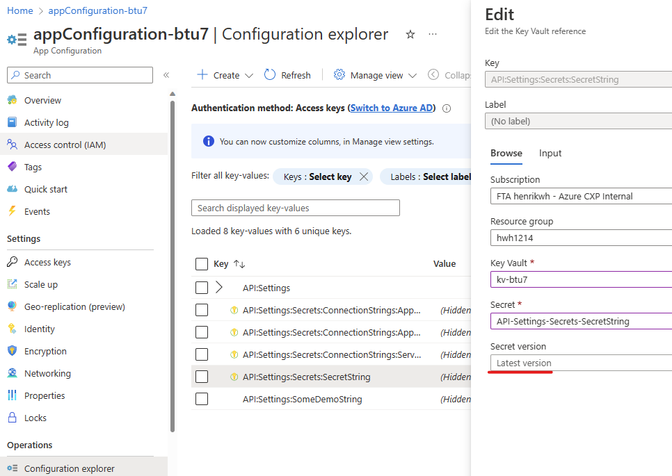
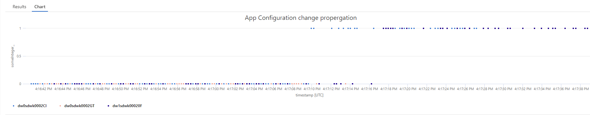

# Dynamic configuration using Azure App Configuration Service

This sample shows how the external configuration store 'Azure App Configuration service' is setup and used for dynamic configuration. Clients are subscribing to change events from App Configuration and reconfiguring clients at runtime. Secrets are served through App Configuration, backed by Key Vault. Managed identity is used to access App Configuration and Key Vault.

See the [external configuration store pattern](https://learn.microsoft.com/en-us/azure/architecture/patterns/external-configuration-store) on Azure Architecture Center.

### Running the sample

1. Clone the repository
2. Go to the scripts folder
3. Run chmod +x *.sh
4. Optional: run `./preReqs.sh` to install needed prerequisites. For manual installation of the prerequisites:
   `apt install jq zip azure-cli dotnet-sdk-7.0`
5. run `./install.sh` to provision Azure resources, build solution and deploy solution
6. run `./test.sh` to poll the deployed API
7. Change values in App Configuration and Key Vault

Installation will provision the azure resources:



To experiment with the sample, launch a browser and go to the App Service web app uri. A swagger contract will open. 

Or run `./test.sh` which will call the `AppConfigDemo` API  which returns values from App Configuration - configuration settings, secret (for test) and feature will be returned. To see that changes in app configuration is pushed to the website, toggle the feature flag `DoMagic$Production` on. 




After a few seconds, any new request against the `AppConfigDemo` API will show feature flag enabled.

Change the `DemoSettings:SomeString` in the JSON document in `API:Settings:$Production` entry:



Call the API again to see the change.

## Context

No matter choice of hosting platform and service, configuration settings is needed for the specific environments and services. Settings should be injected, to ensure that configuration and secrets are separated from the code. [Pattern is referred to as a configuration store](https://learn.microsoft.com/en-us/azure/architecture/patterns/external-configuration-store).

When operating solutions, it is key to have the capability apply configuration changes easily, both for specific services and globally. Classic scenarios are changing log levels to get more or less telemetry, rotate secrets, toggle feature flags and app or service settings.

For [configuration in .NET](https://learn.microsoft.com/en-us/dotnet/core/extensions/configuration) there's the several opportunities to read configuration settings. 

```csharp
IConfiguration config = new ConfigurationBuilder()
    .AddJsonFile("appsettings.json")
    .AddJsonFile($"appsettings.{environment}.json", optional: false, reloadOnChange: true)
    .AddEnvironmentVariables()
    .AddCommandLine(cmdLine)
    .Build();

services.Configure<AppSettings>(configuration.GetSection("AppSettings"));
```

Above `AppSettings` is populated with configuration settings, which is read from json files, environment variables and command line. By default ASP.NET Core reads the same configuration settings using `var builder = WebApplication.CreateBuilder(args);` [in priority](https://learn.microsoft.com/en-us/aspnet/core/fundamentals/configuration/?view=aspnetcore-7.0#default-application-configuration-sources-1).

This works for some setups and for dev environments. But when moving to production, you might want to manage settings centrally, across your entire service landscape. Changes should also be applied gracefully, across the service landscape, without disruption, if possible.

Azure App Configuration can help with that.

## Azure App Configuration service

[App Configuration](https://learn.microsoft.com/en-us/azure/azure-app-configuration/) is a service that serves configurations to application clients - a configuration store. Clients can either poll for changes or subscribe to push notifications/events which signals configuration changes. App Configuration is injected as a configuration provider like json files:

```csharp
var builder = WebApplication.CreateBuilder(args);
string connectionString = builder.Configuration.GetConnectionString("AppConfig");
builder.Configuration.AddAzureAppConfiguration(connectionString);
```

Using the above, configuration is read on startup. No refresh is configured on the subscribing client. 

### Structuring configuration settings

First, consider how to query configuration settings for a service, for an environment. Using configuration files, environment is most often configured using `.AddJsonFile($"appsettings.{environment}.json", optional: false, reloadOnChange: true)`, which will override values defined in `appsettings.json` with the environment specific settings.  Moving into a central store, the consuming services needs to be able to pull settings intended for that particular service, for the specific environment.

App Configuration implements a Label concept, which can be used as a way of specifying the environment.

| Configuration file - bundled with service | App Configuration - externalized from service |
| --------------------- | ------------------------------------------------------------ |
| appsetting.json: "Logging:LogLevel:Microsoft.AspNetCore" : "Information" | Label=blank "Microservice1:Logging:LogLevel:Microsoft.AspNetCore" : "Information" |
| appsetting.production.json "Logging:LogLevel:Microsoft.AspNetCore" : "Warning" | Label=production "Microservice1:Logging:LogLevel:Microsoft.AspNetCore" : "Warning" |

Labels are important, when a client service needs to query for configuration. Labels can contain the environment name, and the prefix (eg 'Microservice1:') can be used from subscribing services, hosted in a given environment.

Read more [here](https://learn.microsoft.com/en-us/azure/azure-app-configuration/howto-labels-aspnet-core?source=recommendations&tabs=core5x) on using labels.

### Poll for configuration changes

Polling for changes is the easiest. `Select` what the service needs to fetch and configure the refresh interval using `SetCacheExpiration`, if anything else but the default is needed. 

```csharp
string env = String.IsNullOrEmpty(Environment.GetEnvironmentVariable("ASPNETCORE_ENVIRONMENT")) ? "Development" : Environment.GetEnvironmentVariable("ASPNETCORE_ENVIRONMENT");
builder.Configuration.AddAzureAppConfiguration(options =>
{
    options.Connect(Environment.GetEnvironmentVariable("ConnectionString"))
		.Select("Microservice1:*") //will retrieve blank labels, for this service
        .Select("Microservice1:{env}}") //will retrieve the environment specific values.
           .ConfigureRefresh(refreshOptions =>
           {
               refreshOptions.Register("Microservice1:Settings", refreshAll: true)
					 .SetCacheExpiration(TimeSpan.FromSeconds(300));
           })
           .UseFeatureFlags();
});
```

[Tutorial: Use dynamic configuration in a .NET Core app - Azure App Configuration | Microsoft Learn](https://learn.microsoft.com/en-us/azure/azure-app-configuration/enable-dynamic-configuration-dotnet-core?source=recommendations#activity-driven-configuration-refresh)

Select statement captures both the blank labels and the environment specific - end result is, that if the environment does not have specific settings, the non environment specific settings are selected.  

> **_Note:_** Make sure to use managed identities to connect to the App Configuration instance, when running on Azure. See sample code provided.

### Push configuration changes

App Configuration service can send events, should configurations change. With that, polling is avoided, and configuration changes are applied as soon as the configuration is refreshed and propagated in the service. But it also becomes a bit more involved to setup the eventing, subscribing to change notifications.

Bicep template in this samples provisions everything, from this [Tutorial: Use dynamic configuration using push refresh in a .NET Core app](https://learn.microsoft.com/en-us/azure/azure-app-configuration/enable-dynamic-configuration-dotnet-core-push-refresh?tabs=windowscommandprompt) as well as a few additional things in bold below.

1) Configuration store
   1) App Configuration store
      1) **Configurations** (API:Settings for different environments) 
      2) **Features** (DoMagic and ShowDebugView)
2) The service
   1) **App Service**. This sample contains an web app for hosting choice. 

3) Subscribing to changes from App Configuration in event grid and sending it to servicebus topic
   1) Event grid, for handling events from App Configuration
      1) Event grid system topic for App Configuration
      2) Event grid subscription, forwarding to Service Bus topic.
   2) Service Bus
      1) Service Bus namespace
      2) Service Bus topic that clients will subscribe to.
4) Security
   1) Azure: User assigned **Managed identity** used to connect to App Configuration
   2) Local: Connection string used to connect to App Configuration, stored in the web app settings.
5) Telemetry
   1) **Application insights sending to Log Analytics workspace**

6) **Key Vault** for handling secrets (can be exposed through App Configuration Service)

#### Configuration Change subscriber

In the sample, theres a background service called `ConfigurationChangeSubscriberService`. The service is responsible to setting up a service bus subscription on the topic which is used by App Configuration to send notifications. 
Below diagram visualizes to overall flow, from subscribing to events from App Configuration, routing the events to a service bus topic and finally subscribing to that topic. The Bicep template takes care of that in this sample - the manual steps are described [here](https://learn.microsoft.com/en-us/azure/azure-app-configuration/enable-dynamic-configuration-dotnet-core-push-refresh?tabs=windowscommandprompt).



For more details on the event schema see [this](https://learn.microsoft.com/en-us/azure/event-grid/event-schema-app-configuration?tabs=event-grid-event-schema).

### Feature manager

Features are a type of configuration data. But .NET has wrapper around the features. Feature toggles provides different filters, that allows to set the behavior of filter. E.g. the percentage filter, when enabled evaluates to true only for that percentage.

```c#
if(_featureManager.IsEnabledAsync("SomeFeature"))
    DoStuff();
```

Features can be managed both in JSON files, but also from App Configuration Service.  And again, feature flags also becomes much more usable when managed centrally, flipped at runtime, without restart, across the service landscape. 

This sample provisions two features via Bicep: `DoMagic`and `ShowDebugView`.

Frist one is outputted in the response of the `AppConfigDemo` API, second one enables `Config` API to out put the configuration values - helpful when troubleshooting configuration.

[Tutorial for using feature flags in a .NET Core app | Microsoft Learn](https://learn.microsoft.com/en-us/azure/azure-app-configuration/use-feature-flags-dotnet-core?tabs=core5x)

### Key Vault, including dynamic refresh of lastest version

App Configuration helps use the services together by creating keys that reference values stored in Key Vault. When App Configuration serves secrets, it stores the URIs of the secret in key vault values rather than the secret values themselves. In effect, that means, that *when new version of the secret are created, it has to be selected in App Configuration Service before the event is fired, even though you set App Configuration to expose 'Latest Version'*. Thats not the same behavior as with configurations (like API:Settings) - if those are changed, a event is fired, which will allow subscribing clients to reload the new configuration.

With that, you loose the ability to automatically rotate secrets before the expire. But, on the other hand, it also gives you the opportunity to control which version of a secret is read by the subscriber making it easy to roll back and forward.

To refresh to latest version of secret, enable feature flag `AutoUpdateLatestVersionSecrets`. Processing of messages are handled in `ConfigurationChangeSubscriberService.MessageHandler`. Enabling the feature flag `AutoUpdateLatestVersionSecrets` will *include* Key Vault event processing besides App Configuration events. If a Key Vault event is received, a configuration refresh is performed - which in will read whatever is configured in App Configuration, aka "Latest Version".  If a specific secret version is exposed in App Configuration, then you have to update/choose the right version as you would do usually. 

> [!TIP]
> Enable the feature flag `AutoUpdateLatestVersionSecrets` to dynamically refresh the secrets exposed with 'Latest Version' in App Service.




[Tutorial for using Azure App Configuration Key Vault references in an ASP.NET Core app | Microsoft Learn](https://learn.microsoft.com/en-us/azure/azure-app-configuration/use-key-vault-references-dotnet-core?tabs=core5x)

#### IOptions interfaces

And finally, the IOptionsSnapshort or IOptionsMonitor is key, if changes are to be reloadable:

| Interface             | Description                                                  |
| --------------------- | ------------------------------------------------------------ |
| `IOptions<T>`         | Only read at startup. Registered as a singleton. *Does not support changes.* |
| `IOptionsSnapshot<T>` | Read on every request. Scoped. Supports reloadable configuration. |
| `IOptionsMonitor<T>`  | Supports change notifications. Singleton.                    |

To leverage dynamic configuration, use the interfaces that supports changes and inject that.

### Monitoring

When ever changes are made to the configuration in App Configuration, it takes a few seconds for the change to apply to all subscribers, as the `_refresher.ProcessPushNotification` default behavior is to mark configuration values as [dirty](https://learn.microsoft.com/en-us/dotnet/api/microsoft.extensions.configuration.azureappconfiguration.iconfigurationrefresher.processpushnotification?view=azure-dotnet) and then periodically refresh the values. Default is 30 seconds. In the sample it can be reconfigured through `ChangeSubscriptionSettings.MaxDelayBeforeCacheIsMarkedDirtyInSeconds`. 

To explore the behavior, the sample is logging a custom metric through `MetricTagsTelemetryInitializer` middleware. The configuration key `DemoSettings:SomeInteger`is written to application insights on each request. That allows for a kql query that shows when the value changes on the nodes. Below configuration changes from 0 to 1.

```kql
requests
| where timestamp > ago(90s)
| where name == "GET AppConfigDemo/Get"
| extend someInteger_ = toint(customMeasurements.someInteger)
| project timestamp, someInteger_, cloud_RoleInstance
| render scatterchart with(title="App Configuration change propergation", ymin=0, ymax=1)
```




Above shows, that theres a time period where nodes have different configurations, which can be changed by setting `ChangeSubscriptionSettings.MaxDelayBeforeCacheIsMarkedDirtyInSeconds`.

Or to get the time period for the configuration to hit the first service to the last:

```kql
requests
| where name == "GET AppConfigDemo/Get"
| where timestamp > ago(30m)
| extend someInteger_ = toint(customMeasurements.someInteger)
| where someInteger_ ==1
| summarize min(timestamp) by cloud_RoleInstance
| summarize First=min(min_timestamp), Last=  max(min_timestamp)
| project datetime_diff('millisecond', Last,First)
```

The sample also refreshes secrets from Key Vault following the same. But this happens instantly, as its using `IConfigurationRoot.Refresh()`.   


### Adding configuration values using Bicep

The sample contains a Bicep module that helps add entries to App Configuration service.  If keyVaultName parameter is provided, the value will be added to key vault and exposed in App Configuration service. Besides that, RBAC is setup for the entry in the Key Vault allowing for the managed identity to read the Key Vault entry.

```bicep
module SomeTestValue 'modules/addAppConfiguration.bicep' =  {
  name: 'SomeTestValue'
  params: {
    keyName: 'API:Settings:SomeDemoString'
    managedIdentityWithAccessToAppConfiguration: webappUamis.name
    value: 'test'
    appConfigName : configurationStore.name
  }
}
module SomeSecretTestValue 'modules/addAppConfiguration.bicep' =  {
  name: 'SomeSecretTestValue'
  params: {
    keyName: 'API:Settings:Secrets:SecretString'
    managedIdentityWithAccessToAppConfiguration: webappUamis.name
    value: 'test value in kv'
    appConfigName : configurationStore.name
    keyVaultName: keyVault.name //when provided, it will store the value in KV
  }
}
```

### Running the sample locally

When running the `install.sh`, the 'production' environment on Azure is provisioned. This means that managed identities are used to access App Configuration. When running local, you need to setup access to App Configuration and Key Vault. Heres the steps:

* After running the `install.sh` a config.json file is stored. Theres a connectionStrings section, in secrets.json, add the folllow and replace `#from config.json#` with the values from config.json
  ```
  {
    "ChangeSubscription:ServiceBusConnectionString": "#from config.json#,
    "ConnectionStrings:AppConfig": "#from config.json#"
  }
  ```

* Create a Service Principal, with access to App Configuration service and Key Vault (view granted permissions for the managed identity)

* Provide the details of the Service Principal in the secrets.json 
  ``` json
  {
  	"AppConfig" :{
          "ServicePrincipal" : {
              "TenantId" :"#value#",
              "ClientId" :"#value#",
              "Secret":"#value#"
          }
      }
  }
  ```

Then you're ready to launch locally.

Try and changing settings in `API:Settings$Development`, to see events arriving and outputted in the console (and Application insights if you want).

### Further reading

[Quickstart for Azure App Configuration with ASP.NET Core | Microsoft Learn](https://learn.microsoft.com/en-us/azure/azure-app-configuration/quickstart-aspnet-core-app?tabs=core6x)

[Azure/AppConfiguration: Questions, feedback and samples for Azure App Configuration service (github.com)](https://github.com/Azure/AppConfiguration)

[Azure App Configuration best practices | Microsoft Learn](https://learn.microsoft.com/en-us/azure/azure-app-configuration/howto-best-practices)

[Quickstart for adding feature flags to ASP.NET Core | Microsoft Learn](https://learn.microsoft.com/en-us/azure/azure-app-configuration/quickstart-feature-flag-aspnet-core?tabs=core6x)

[Automatically back up key-values from Azure App Configuration stores | Microsoft Learn](https://learn.microsoft.com/en-us/azure/azure-app-configuration/howto-backup-config-store)

[External Configuration Store pattern - Azure Architecture Center | Microsoft Learn](https://learn.microsoft.com/en-us/azure/architecture/patterns/external-configuration-store)

[Azure App Configuration resiliency and disaster recovery | Microsoft Learn](https://learn.microsoft.com/en-us/azure/azure-app-configuration/concept-disaster-recovery?tabs=core3x)

